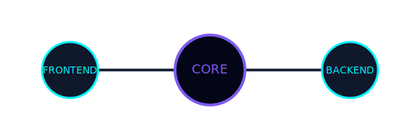
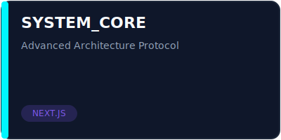
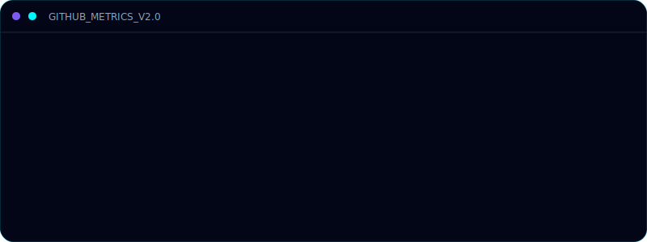
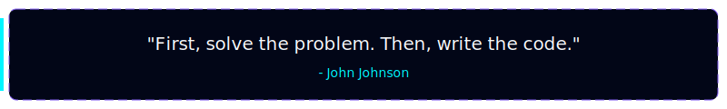

<!-- CYBERPUNK THEME METADATA -->

<!-- HERO SECTION -->

# Hi, I'm Pilli SriramMohan 

### 

 

 

<!-- TERMINAL ABOUT ME -->
<h2>[ WHOAMI ]</h2>

 
 

<!-- TECH STACK -->
<h2>[ NEURAL_NETWORK / TECH_STACK ]</h2>

 

 

 

<!-- CURRENT PROJECTS (TABLE BASED CARDS) -->
<h2>[ ACTIVE_DIRECTIVES / PROJECTS ]</h2>

<table bordercolor="#1E293B" align="center" width="90%">
  <tr align="center">
    <td width="50%">
       
      <h3>🌐 VSource CRM</h3>
      
Enterprise-grade CRM for Overseas Education. Role-based access control, complex workflows, and student management pipelines.

      <code>Next.js App Router</code> • <code>TypeScript</code> • <code>TailwindCSS</code>
    </td>
    <td width="50%">
        
      <h3>✈️ SkyBlue CRM</h3>
      
Complete ERP solution for Airline Catering Operations. Optimizes supply chain, real-time inventory tracking, and logistics.

      <code>NestJS</code> • <code>PostgreSQL</code> • <code>Prisma</code>
    </td>
  </tr>
  <tr align="center">
    <td width="50%">
      <h3>🤖 AI SaaS Experiments</h3>
      
Exploring and developing modern AI-driven tools, leveraging LLMs to solve hyper-local business problems.

      <code>OpenAI APIs</code> • <code>Vector DBs</code> • <code>Framer Motion</code>
    </td>
    <td width="50%">
      <h3>📊 Enterprise Admin Dashboards</h3>
      
Building high-performance, data-dense interfaces with beautifully crafted components using shadcn/ui and Radix.

      <code>React</code> • <code>shadcn/ui</code> • <code>Recharts</code>
    </td>
  </tr>
</table>

 

 

<!-- GITHUB STATS DASHBOARD -->
<h2>[ TELEMETRY / METRICS ]</h2>

  
  

    
    
  

 
 

 
 

<!-- CONTRIBUTION SNAKE -->
<h2>[ CONTRIBUTION_MATRIX ]</h2>

<picture>
  <source media="(prefers-color-scheme: dark)" srcset="https://raw.githubusercontent.com/Srirammohan03/Srirammohan03/output/dist/github-snake-dark.svg">
  <source media="(prefers-color-scheme: light)" srcset="https://raw.githubusercontent.com/Srirammohan03/Srirammohan03/output/dist/github-snake.svg">
  
</picture>

 
 

<!-- TROPHIES -->
<h2>[ ACHIEVEMENTS ]</h2>

 

 

<!-- ANIMATED QUOTE -->

 
 

<!-- CONNECT -->
<h2>[ ESTABLISH_CONNECTION ]</h2>

 
 

<!-- FOOTER -->

